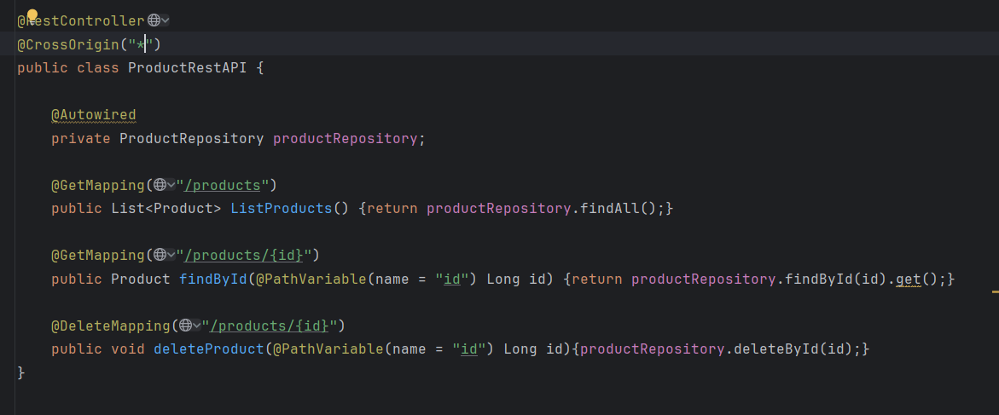
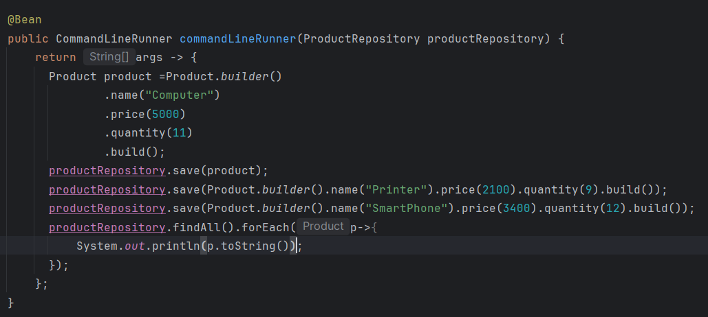
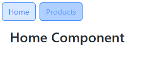
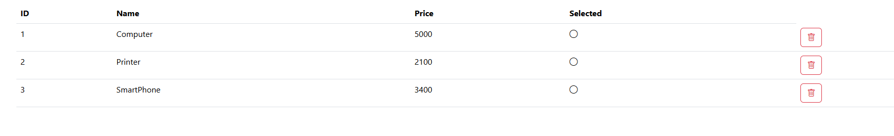
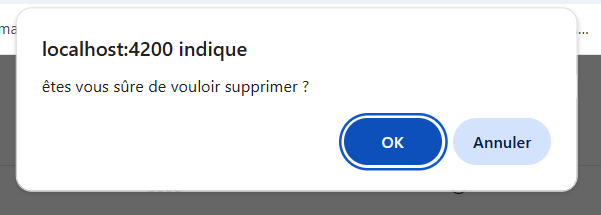
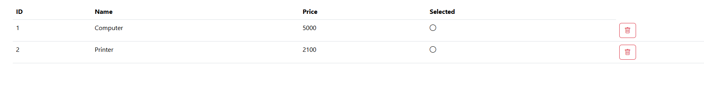

<h1>Controller Backend</h1>

<h1>Enregistrer des données dans la base de donnée</h1>

<h1>Home Component</h1>

<h1>Liste des Produits</h1>

<h1>Suppression du produits id=3</h1>

<h1>Liste des Produits apres Suppression</h1>

